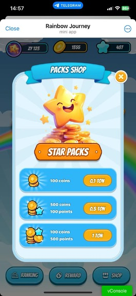
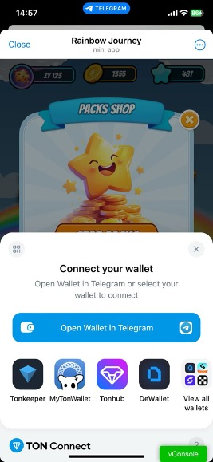
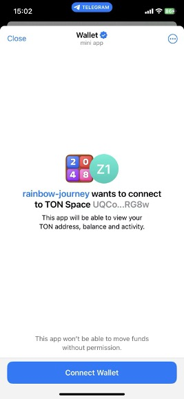
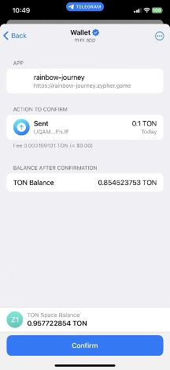

+++
title = "CocosCreator with Telegram Game (Part 2) - TON Payment"
description = "Learning how to use CocosCreator to develop Telegram game and use the TON payment"
date = 2024-09-19T18:50:42+00:00
updated = 2024-9-19T18:50:42+00:00
draft = false
template = "blog/page.html"

[taxonomies]
authors = ["Zypher Dev"]

[extra]
toc = true
lead = "Learning how to use CocosCreator to develop Telegram game and use the TON payment"
+++

# CocosCreator Development of Telegram Games (Part Two) - TON Payment

In this article, we will continue to explore how to develop Telegram games using `CocosCreator`, focusing on how to integrate TON payment functionality. Through this tutorial, you will learn how to connect to `TON Connect` in your game, implement wallet connection, payment, and the verification after pay, and then providing decentralized payment for your game. Next, we will introduce how to implement TON payment integration step by step. We hope this tutorial will be helpful to you.

## CocosCreator + Telegram
If you don't know much about CocosCreator and Telegram, you can read [previous blog](https://docs.zypher.network/blog/cocos-tg/) first.

## Integrate TON Connect into your game
### 1. Add `tonconnect-ui.min.js` to the index.html
```html
<script src="https://unpkg.com/@tonconnect/ui@latest/dist/tonconnect-ui.min.js"></script>
```

### 2. Add a div to use the wallet
```html
<!-- Add this div into HTML -->
<div id="ton-connect"></div>
```

### 3. Initialize TonconnectUI
```javascript
// TonConnectUI
// @ts-ignore
this.tonConnectUI = new window.TON_CONNECT_UI.TonConnectUI(
{
  manifestUrl: 'https://xxxxxxxx/tonconnect-manifest.json',
  buttonRootId: 'ton-connect', // confirm this ID is the same as above div
  chain: 'testnet',
  network: 'testnet', // mainnet
});

// Redirect the user to the Telegram mini program after the wallet is connected
this.tonConnectUI.uiOptions = {
  twaReturnUrl: 'https://t.me/RainbowJourneyBot',
};
```



### 4. Connect to wallet
```javascript
const connectedWallet = await this.tonConnectUI.connectWallet().catch(error => {
  console.error('Error connecting to wallet:', error);
});

// disconnect wallet
await tonConnectUI.disconnect();
```





### 5. Pay
```javascript
const time = Math.floor(Date.now() / 1000) + 600;
const str = `${PlayerModel.inst.tg_userInfo.id}||${time}`;
const body = beginCell()
             .storeUint(0, 32) // write 32 zero bits to indicate that a text comment will follow
             .storeStringTail(str) // write our text comment
             .endCell();

const paymentRequest = {
  address: 'UQB7RFm0dj-LYhs7UYtsYna_xxxxx_jrUoemFQmO9JT', // receiver address
  amount: amount.toString(),                              // amount, unit is ns (1 TON = 1,000,000,000ns )
  payload: body.toBoc().toString('base64'),               // optional, external payload data
};

const response = await this.tonConnectUI.sendTransaction({
  validUntil: time, // peroid time, unit is seconds
  messages: [paymentRequest],
});

// after pay, continue ...
```

### 6. Verify
After the payment is completed, you will get the `boc`, and take the boc to the backend for verification to obtain the in-game items.
```javascript
{
  boc: "te6cckEBAwEA4QAC44gBZUPZ6qi8Dtmm1cot1P175lXUARlUVwlfMM19lkERK1oCUB3RqDxAFnPpeo191X/jiimn9Bwnq3zwcU/MMjHRNN5sC5tyymBV3SJ1rjyyscAjrDDFAIV/iE+WBySEPP9wCU1NGLsfcvVgAAACSAAYHAECAGhCAFlQ9nqqLwO2abVyi3U/XvmVdQBGVRXCV8wzX2WQRErWoAmJaAAAAAAAAAAAAAAAAAAAAGZCAFlQ9nqqLwO2abVyi3U/XvmVdQBGVRXCV8wzX2WQRErWnMS0AAAAAAAAAAAAAAAAAAADkk4U"
}

const address = Address.parse('UQB7RFm0dj-LYhs7UYtsYna_xxxxxx_jrUoemFQmO9JT');
const client = new TonClient({
    endpoint: 'https://testnet.toncenter.com/api/v2/jsonRPC',
});
const pollInterval = 3000; // 3 seconds
const maxAttempts = 20; // 1 minute max wait time (3 seconds * 20 attempts)
const checkTransactions = async (attempt: number) => {
  try {
    const trans = await client.getTransactions(address, { inclusive: false, limit: 1 });

    for (const tran of trans) {
      if (tran.inMessage) {
        //@ts-ignore
        const payCoins = tran.inMessage.info.value.coins;
        const desStr = tran.inMessage.body.beginParse().loadStringTail();
        // next check order
      if (attempt < maxAttempts) {
        setTimeout(() => checkTransactions(attempt + 1), pollInterval);
      } else {
        // update tx status to failed
        transaction.status = 'failed';
        return res.status(200).json({ errorcode: 4, error: 'no message' });
    }};
  } catch (err) {
    console.error('process-transaction error:', err);
    res.status(200).json({ errorcode: 6, error: 'internal server error' });
  }
}
```



That's all, the centralized game connect to Telegram payment in ton has ended. I hope it will be helpful to you.
