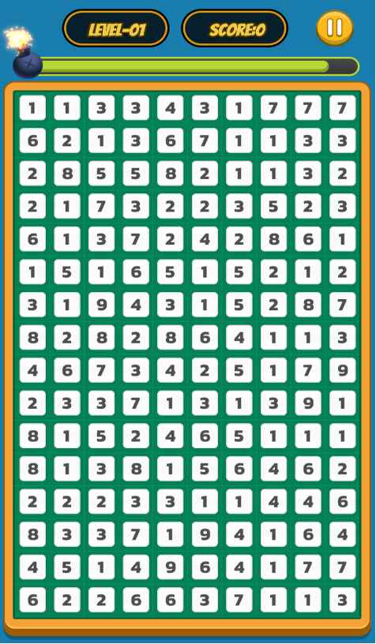
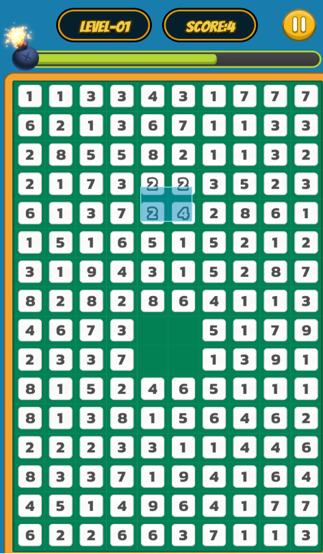

+++
title = "CocosCreator with Telegram Game (Part 3) - ZKP"
description = "Learning how to use CocosCreator to develop Telegram game with zero-knowledge proof"
date = 2024-10-30T18:50:42+00:00
updated = 2024-10-30T18:50:42+00:00
draft = false
template = "blog/page.html"

[taxonomies]
authors = ["Zypher Dev"]

[extra]
toc = true
lead = "Learning how to use CocosCreator to develop Telegram game with ZKP"
+++

# CocosCreator Development of Telegram Games (Part Three) - ZKP

Zero-Knowledge Proof (ZKP) is an advanced cryptography technology that allows one party (prover) ​​to prove to another party (verifier) ​​that it owns some information or meets a condition without revealing any specific information. The core of this technology is to protect the privacy of users while ensuring the authenticity and security of data. The wide application of zero-knowledge proof covers many fields such as blockchain, identity authentication, privacy protection, etc., helping to improve data security and user trust.

Take the game `Ten Sum Rings` for example, which is played by asking the user to circle a specific area on the screen. If the sum of all numbers in the range equals 10, the operation is successful. When users play games, they are actually utilizing the principle of zero-knowledge proof. Specifically, users can prove to the verifier that the sum of the areas they circle is indeed 10, without revealing the specific numbers in the area. Through such a design, users can protect their private information while ensuring the fairness of the game.

In the game implementation, the user's circled area can be verified through the zk circuit, and the verifier confirms and meets the condition based on the proof generated by the circuit. In this way, even if the verifier cannot access the user's specific circle number, it can still trust the user's operation result. Through zero-knowledge proof, the Ten Sum Rings game not only enhances privacy protection, but also improves participants’ sense of security and promotes the innovative use of blockchain technology in games and applications.





Zero-knowledge circuits (zk circuits) are the core components of zero-knowledge proof systems and are mainly used to describe specific logical or mathematical calculations. The zk circuit is a logic circuit model consisting of multiple gates and wires. Each gate represents a basic operation such as addition, multiplication, and comparison, while the lines represent numerical inputs, outputs, or intermediate results. The design of the zk circuit allows complex calculations to be combined through simple basic operations, thereby realizing arbitrary calculation logic.

In a zk circuit, there are three important components:
*Input value*: including public input (public input) and private input (private input). Public inputs are data accessible to the verifier, while private inputs are confidential data of the prover and cannot be leaked directly to the verifier.
*Circuit logic*: consists of a series of operations that define the logical flow of calculations. The design of the circuit needs to ensure that complex calculation processes can be effectively expressed and operational efficiency optimized.
*Output value*: The output data finally generated by the zk circuit for use by the verifier. The output value is often used to verify the correctness of the calculation without revealing the specific content of the input.
In this way, zk circuits ensure the transparency and credibility of computing while protecting privacy, and promote the application and development of private computing.

Here is the verifier contract for the circuit (FunC):
```
#include "imports/stdlib.fc";

const op::verify = "op::verify"c;
const int P1_SIZE = 48 * 8;
const int P2_SIZE = 96 * 8;
const slice IC0 = ""s;
const slice IC2 = ""s;
const slice IC3 = ""s;
const slice IC4 = ""s;
const slice IC5 = ""s;
const slice IC6 = ""s;
const slice IC7 = ""s;
const slice vk_gamma_2 = ""s;
const slice vk_delta_2 = ""s;
const slice vk_alpha_1 = ""s;
const slice vk_beta_2 = ""s;
slice bls_g1_add(slice x, slice y) asm "BLS_G1_ADD";
slice bls_g1_neg(slice x) asm "BLS_G1_NEG";
slice bls_g1_multiexp(
   slice x1, int y1,
   slice x2, int y2,
   slice x3, int y3,
   slice x4, int y4,
   slice x5, int y5,
   slice x6, int y6,
   slice x7, int y7,
   int n
) asm "BLS_G1_MULTIEXP";
int bls_pairing(slice x1, slice y1, slice x2, slice y2, slice x3, slice y3, slice x4, slice y4, int n) asm "BLS_PAIRING";
global int ctx_res;
;; load_data populates storage variables using stored data
() load_data() impure {
   var ds = get_data().begin_parse();
   ctx_res = ds~load_uint(32);
   ds.end_parse();
}
;; save_data stores storage variables as a cell into persistent storage
() save_data() impure {
   set_data(
       begin_cell()
           .store_uint(ctx_res, 32)
           .end_cell()
   );
}
(slice, slice) load_p1(slice body) impure {
   cell c = body~load_ref();
   slice s = c.begin_parse();
   slice p1 = first_bits(s, P1_SIZE);
   s~skip_bits(P1_SIZE);
   return (s, p1);
}


(slice, slice) load_p2(slice body) impure {
   cell c = body~load_ref();
   slice s = c.begin_parse();
   slice p2 = first_bits(s, P2_SIZE);
   s~skip_bits(P2_SIZE);
   return (s, p2);
}


(slice, int) load_newint(slice body) impure {
   cell c = body~load_ref();
   slice s = c.begin_parse();
   int x = s~load_uint(256);
   return (s, x);
}


() groth16Verify(
   slice pi_a,
   slice pi_b,
   slice pi_c,
   int pubInput0 ,
   int pubInput1 ,
   int pubInput2 ,
   int pubInput3 ,
   int pubInput4 ,
   int pubInput5 ,
   int pubInput6
) impure {
   slice cpub = bls_g1_multiexp(
       IC1, pubInput0,
       IC2, pubInput1,
       IC3, pubInput2,
       IC4, pubInput3,
       IC5, pubInput4,
       IC6, pubInput5,
       IC7, pubInput6,
       7
   );
   cpub = bls_g1_add(cpub, IC0);
   slice pi_a_neg = bls_g1_neg(pi_a);
   int a = bls_pairing(
       cpub, vk_gamma_2,
       pi_a_neg, pi_b,
       pi_c, vk_delta_2,
       vk_alpha_1, vk_beta_2,
       4);
   ;; ctx_res = a;
   if (a == 0) {
       ctx_res = 0;
   } else {
       ctx_res = 1;
   }
   save_data();
}


() recv_internal(int my_balance, int msg_value, cell in_msg_full, slice in_msg_body) impure {
   if (in_msg_body.slice_empty?()) { ;; ignore all empty messages
       return ();
   }
   slice cs = in_msg_full.begin_parse();
   int flags = cs~load_uint(4);
   if (flags & 1) { ;; ignore all bounced messages
       return ();
   }
   int op = in_msg_body~load_uint(32); ;; by convention, the first 32 bits of incoming message is the op
   int query_id = in_msg_body~load_uint(64); ;; also by convention, the next 64 bits contain the "query id", although this is not always the case
   if (op == op::verify) {
       slice pi_a = in_msg_body~load_p1();
       slice pi_b = in_msg_body~load_p2();
       slice pi_c = in_msg_body~load_p1();
       int pubInput0 = in_msg_body~load_newint();
       int pubInput1 = in_msg_body~load_newint();
       int pubInput2 = in_msg_body~load_newint();
       int pubInput3 = in_msg_body~load_newint();
       int pubInput4 = in_msg_body~load_newint();
       int pubInput5 = in_msg_body~load_newint();
       int pubInput6 = in_msg_body~load_newint();
       groth16Verify(
           pi_a,
           pi_b,
           pi_c,
           pubInput0 ,
           pubInput1 ,
           pubInput2 ,
           pubInput3 ,
           pubInput4 ,
           pubInput5 ,
           pubInput6
       );
       return ();
   }
   throw(0xffff); ;; if the message contains an op that is not known to this contract, we throw
}
int get_res() method_id {
   load_data();
   return ctx_res;
}
```

Before deploying the TON contract, the following preparations need to be completed:

1. Write contract code: Use FunC language or other contract languages ​​that support TON Virtual Machine (TVM) to write contract logic to ensure the functional requirements and security of the contract.
2. Install TON CLI tools: Use the command line tools officially provided by TON. These tools can help you compile, deploy contracts and interact with the blockchain.
3. Prepare a TON wallet: Create and prepare a TON wallet to provide the initial deployment fee for the contract. This wallet must have enough TON tokens.

The overall process of deployment and interaction:
1. Write contract code: Use FunC or other contract languages ​​to write contract logic.
2. Compile contract code: Use the func tool to compile the contract code and generate a .fif file.
3. Generate the .boc bytecode of the contract: Convert the .fif file into the bytecode (.boc file) of the contract through the fift tool, which is the key for the contract to run on TON.
4. Generate contract address: Generate the contract address based on the bytecode and initialization parameters of the contract.
5. Provide initial funds: Recharge the generated contract address to meet deployment costs.
6. Deploy the contract to the TON network: Use the deploy command of the TON CLI to deploy the contract to the network.
7. Verify contract status: Confirm whether the contract is successfully deployed by querying the contract address.
8. Interact with the contract: Use TON SDK or CLI to call contract methods for data query or status update.

Here is `Ten Sum Rings` contract deployment code:
```javascript
import * as fs from "fs";
import { getHttpEndpoint } from "@orbs-network/ton-access";
import { mnemonicToWalletKey } from "ton-crypto";
import { TonClient, Cell, WalletContractV4 } from "@ton/ton";
import Counter from "../wrappers/Counter"; // this is the interface class from step 7

export async function run() {
 // initialize ton rpc client on testnet
 const endpoint = await getHttpEndpoint({ network: "testnet" });
 const client = new TonClient({ endpoint });

 // prepare Counter's initial code and data cells for deployment
 const counterCode = Cell.fromBoc(fs.readFileSync("build/verifier.cell"))[0]; // compilation output from step 6
 const initialCounterValue = Date.now(); // to avoid collisions use current number of milliseconds since epoch as initial value
 const counter = Counter.createForDeploy(counterCode, initialCounterValue);


 // exit if contract is already deployed
 console.log("contract address:", counter.address.toString());
 if (await client.isContractDeployed(counter.address)) {
   return console.log("Counter already deployed");
 }


 // open wallet v4 (notice the correct wallet version here)
 const mnemonic = "** weather impose drop"; // your 24 secret words (replace ... with the rest of the words)
 const key = await mnemonicToWalletKey(mnemonic.split(" "));
 const wallet = WalletContractV4.create({ publicKey: key.publicKey, workchain: 0 });
 console.log("wallet.address: ",wallet.address);
 if (!await client.isContractDeployed(wallet.address)) {
   return console.log("wallet is not deployed");
 }


 // open wallet and read the current seqno of the wallet
 const walletContract = client.open(wallet);
 const walletSender = walletContract.sender(key.secretKey);
 const seqno = await walletContract.getSeqno();


 // send the deploy transaction
 const counterContract = client.open(counter);
 await counterContract.sendDeploy(walletSender);


 // wait until confirmed
 let currentSeqno = seqno;
 while (currentSeqno == seqno) {
   console.log("waiting for deploy transaction to confirm...");
   await sleep(1500);
   currentSeqno = await walletContract.getSeqno();
 }
 console.log("deploy transaction confirmed!");
}


function sleep(ms: number) {
 return new Promise(resolve => setTimeout(resolve, ms));
}
```

The process of calling the TON contract in Cocos Creator is as follows:

After the TON contract is successfully deployed and the contract address is obtained, the front end can interact with the contract by integrating the TON SDK (such as TonWeb or TonConnect). In the Cocos Creator project, use JavaScript to call the interface provided by the SDK, send a request based on the contract address and method name, and pass the necessary parameters and signature information. The data returned by the contract is then processed to realize the interaction between the front end and the contract on the chain.
```javascript
let board = board.map(row => row.map(num => BigInt(num)));
let operations = operations.map(row => row.map(num => BigInt(num)));
let board_new = board_new.map(row => row.map(num => BigInt(num)));


let input = {
   board: board,
   operations: operations,
};


let wasmPath = this.main_wasm.nativeUrl;//wasm资源地址
let zkeyPath = this.circuit_final_zkey.nativeUrl;//zkey资源地址
let { proof, publicSignals } = await snarkjs.groth16.fullProve(input, wasmPath, zkeyPath);
let curve = await buildBls12381();
let proofProc = unstringifyBigInts(proof);
var pi_aS = g1Compressed(curve, proofProc.pi_a);
var pi_bS = g2Compressed(curve, proofProc.pi_b);
var pi_cS = g1Compressed(curve, proofProc.pi_c);
var pi_a = Buffer.from(pi_aS, 'hex');
var pi_b = Buffer.from(pi_bS, 'hex');
var pi_c = Buffer.from(pi_cS, 'hex');


var pubInputs = publicSignals;
// const endpoint = await getHttpEndpoint({ network: "testnet" });
const endpoint = await globalThis.TonAccess.getHttpEndpoint({ network: 'mainnet' }); //testnet
console.log('endpoint: ', endpoint);
const time = Math.floor(Date.now() / 1000) + 600;
let amount = 150000000;
let opts = {};
opts['pi_a'] = pi_a;
opts['pi_b'] = pi_b;
opts['pi_c'] = pi_c;
opts['pubInputs'] = pubInputs;
opts['value'] = toNano('0.15');


const body = beginCell()
   .storeUint(Opcodes.verify, 32)
   .storeUint(opts['queryID'] ?? 0, 64)
   .storeRef(
       beginCell()
           .storeBuffer(opts['pi_a'])
           .storeRef(
               beginCell()
                   .storeBuffer(opts['pi_b'])
                   .storeRef(beginCell().storeBuffer(opts['pi_c']).storeRef(this.cellFromInputList(opts['pubInputs'])))
           )
   )
   .endCell();
const paymentRequest = {
   address: 'EQDgJPK_N*******qaRtrhBWjk5Dx',
   amount: amount.toString(),
   payload: body.toBoc().toString('base64'),
};


try {
   const response = await tonConnectUI.sendTransaction({
       validUntil: time, // 交易有效期，以秒为单位
       messages: [paymentRequest],
   });
   console.log('Payment successful:', response);
} catch (e) {
 console.error('Payment failed')
}
```

The above is the on-chain verification process based on zk circuit and TON contract in Cocos Creator, which mainly includes the following steps: write zk circuit to design privacy calculation logic, generate zero-knowledge proof (ZKP) parameters, write the contract as FunC code and Compile it into TVM bytecode, and then deploy it on the TON network. Verification and data interaction are performed through the TON contract to achieve efficient and privacy-safe on-chain verification, ensuring data integrity and user privacy protection.

