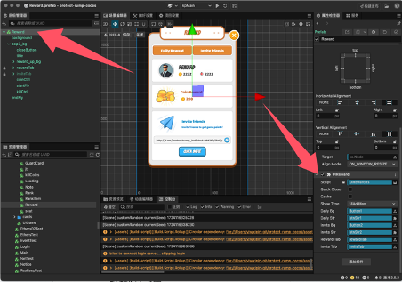

+++
title = "CocosCreator with Telegram Game"
description = "Learning how to use CocosCreator to develop Telegram game"
date = 2024-08-28T18:50:42+00:00
updated = 2024-09-18T18:50:42+00:00
draft = false
template = "blog/page.html"

[taxonomies]
authors = ["Zypher Dev"]

[extra]
toc = true
lead = "Learning how to use CocosCreator to develop Telegram game"
+++

## 1. Understanding CocosCreator

Official Website
- Cocos Official Website: [https://www.cocos.com/](https://www.cocos.com/)
Documentation Address
- Cocos Creator Documentation: [https://docs.cocos.com/creator/manual/en/](https://docs.cocos.com/creator/manual/en/)
- Cocos Creator API Reference: [https://docs.cocos.com/creator/api/en/](https://docs.cocos.com/creator/api/en/)

Forum Address
- Cocos Official Forum: [https://forum.cocos.org/](https://forum.cocos.org/)


## 2. Overview of CocosCreator Versions (1.x is mostly unusable, most are 2.x, 3.x 3D games are more common)

Cocos Creator is a complete game development solution that provides an integrated development environment, supporting both 2D and 3D game development. Cocos Creator adopts a component-based and data-driven workflow, simplifying the complexity of game development. It is based on the Cocos2d-x engine and has strong extensibility and flexibility.

Main features include:
- Component-based design: Developers can quickly build game logic by dragging and dropping components.
- Cross-platform support: Supports export to multiple platforms, including Web, iOS, Android, Windows, Mac, etc.
- Rich editing tools: Provides scene editor, animation editor, particle editor, code editor, etc.
- Script support: Mainly uses JavaScript and TypeScript to write game logic.

**Main Versions of Cocos Creator and Their Differences**
Cocos Creator 1.x Series
- Cocos Creator 1.x is the earliest version of Cocos Creator, with main features including:
- Basic functionality: Basic scene editing, component system, animation editor.
- JavaScript support: Mainly uses JavaScript as the scripting language.
- Basic plugin system: Allows developers to extend editor functionality.
- Web and native platform support: Can export to Web and native platforms (iOS and Android).

Cocos Creator 2.x Series
The Cocos Creator 2.x series introduces many improvements and new features:
- Performance optimization: Improved engine performance, especially on mobile devices.
- TypeScript support: Introduced TypeScript support, enhancing code maintainability and type safety.
- Physics engine integration: Built-in Box2D and Chipmunk physics engines, supporting 2D physics effects.
- Resource management optimization: Improved resource management system for more efficient resource loading and management.
- Enhanced UI system: Enhanced UI components and layout system, providing stronger UI editing capabilities.

Cocos Creator 3.x Series
The Cocos Creator 3.x series is a major version update with main features including:
- 3D support: Fully supports 3D game development, providing rich 3D features and editor tools.
- Unified engine architecture: Integrates 2D and 3D engines, providing a consistent API and workflow.
- Rendering engine update: Introduces a new rendering engine that supports PBR (Physically Based Rendering), global illumination, shadows, and other advanced effects.
- Enhanced animation system: Provides more powerful animation editing and playback capabilities, supporting complex animation effects.
- Optimized cross-platform support: Further optimizes the export and publishing process, supporting more platforms and devices.
- Editor enhancements: Provides richer editor plugins and extension mechanisms, enhancing developer productivity.

## 3. Starting the Source Code Project (if you purchased a source code) Specific details can be found in the documentation

### 3.1 Install Cocos Creator
If you have not installed Cocos Creator, please go to the Cocos official website to download and install the latest version.

### 3.2 Open Cocos Creator
After installation, launch the Cocos Creator editor.

### 3.3 Open the Project
#### 3.3.1 Import the project:
- In the Cocos Creator startup interface, click the Open Project button.
- Browse to the folder of the Cocos Creator project source code you obtained, select that folder, and then click Select Folder.

#### 3.3.2 Check project configuration:
- After the project opens successfully, check the assets folder to ensure all resource files are in the correct location.
- Check Project -> Project Settings to ensure the project's resolution and other settings meet your needs.

### 3.4 Run the Project

#### 3.4.1 Select Scene:
- In the assets folder, find your main scene file (usually ending with fire or scene).
- Double-click the main scene file to open it in the editor.

#### 3.4.2 Run the project:
- Click the Play button (green triangle button) at the top of the editor to preview and run the project in the editor.
- If the project runs normally, you will see the game screen in the editor's game window.

### 3.5 Build and Publish the Project to Web Mobile

#### 3.5.1 Open the Build Panel:
- In the top menu bar of the editor, select Project -> Build.

#### 3.5.2 Select Platform:
- In the build panel, select Web Mobile as the target platform.

#### 3.5.3 Set Build Options:
- Build Path: Set the folder path for the build output.
- Start Scene: Select the scene to load when the game starts.
- Main Bundle Compression Type: Choose a compression type (e.g., None, Zip, JPG, etc.).
- Zip Compression Level: If you selected Zip compression type, you can set the compression level.
- MD5 Cache: Enable MD5 caching to add MD5 hash values to all resource files for version control and cache management.
- Source Maps: Generate Source Maps files for debugging.
- Debug Mode: Enable debug mode to retain debug information and log output in the published code.
- Inline all Sprite Frames: Inline all sprite frames into one file.
- Merge all JSON Files: Merge all JSON files into one file.

#### 3.5.4 Build the Project:
- Click the Build button to start building the project.
- After the build is complete, the build output files will be generated in the specified build path.

#### 3.5.5 Publish the Project:
- Upload the generated build output files to a server that supports HTTPS, such as GitHub Pages, Netlify, Vercel, or other static website hosting services.

### 3.6 Debugging and Optimization

#### 3.6.1 Enable Source Maps:
- In the build panel, enable the Source Maps option to generate Source Maps files for debugging the published code.
- After publishing, you can use Source Maps to debug the code in the browser's developer tools.

#### 3.6.2 Enable MD5 Cache:
- In the build panel, enable the MD5 Cache option to add MD5 hash values to all resource files.
- This ensures that users do not load old resources due to caching issues when updating the game.

#### 3.6.3 Debug Mode:
- In the build panel, enable the Debug Mode option to retain debug information and log output.
- If debugging is needed during the publishing process, you can enable this option in the build panel.

### 3.7 Test the Project

#### 3.7.1 Local Testing:
- Test the build output files on a local server to ensure the game performs and is compatible across different browsers.
- You can use the Live Server plugin in VS Code or other local server tools for testing.

#### 3.7.2 Online Testing:
- After uploading the build output files to the server, test the online version to ensure all functions operate normally.

Through these steps, you can successfully start and publish a Cocos Creator project source code to the Web platform and understand the configuration and use of publishing attributes such as debug mode and MD5 cache.


## 4. Protect Trump Cocos Code Explanation
### 4.1 New project
Create a new scene, create a node in the scene, and attach the script GameLanch.ts.
(I also placed the background image for the main interface here for preloading, but it can be omitted.)


### 4.2 Game Lanch
GameLanch.ts.
```javascript
// Manage global data
PlayerModel.inst.init();

// Initialize game framework
this.node.addComponent(ResMgr);
this.node.addComponent(UIConfig);
// end

this.node.addComponent(GameApp);

```
Configure page information in the UIConfig.ts file
Use the uiManager interface to control the UI
```javascript
uiManager.open(UIID.UILoading);
```

### 4.3 Telegram Data Retrieval
Add the following script reference in the template folder build-teleplates/web-mobile/index.html
```html
<script async src="https://telegram.org/js/telegram-web-app.js"></script>
```

In the game script, relevant references were also added for debugging mode use
```javascript
// Create and insert the Telegram Web App SDK script
loadTelegramSDK() {
    // this.url.string = ‘loadTelegramSDK’
    return new Promise<void>((resolve, reject) => {
        if (window[‘Telegram’] && window[‘Telegram’].WebApp) {
            // Telegram SDK has already been loaded
            console.log(‘Telegram SDK has already been loaded:’, window[‘Telegram’]);
            window[‘Telegram’].WebApp.ready();
            resolve();
            return;
        }
        const script = document.createElement(‘script’);
        script.src = ‘https://telegram.org/js/telegram-web-app.js’;
        script.onload = () => {
            console.log(‘SDK loaded successfully:’, window[‘Telegram’]);
            window[‘Telegram’].WebApp.ready();


            // SDK loaded successfully
            resolve();
        };
        script.onerror = error => {
            console.log(‘SDK loading failed:’, error);
            // SDK loading failed
            reject(error);
        };
        document.head.appendChild(script);
    });
}


processInitData() {
    const initData = window[‘Telegram’]?.WebApp?.initData;
    if (initData) {
        const searchParams = new URLSearchParams(initData);
        const WebAppData = {};
        for (const [key, value] of searchParams.entries()) {
            WebAppData[key] = value;
        }
        console.log(‘WebAppData:’, WebAppData);
        // Get user information
        const user = window[‘Telegram’].WebApp.initDataUnsafe;
        console.log(‘User:’, user);
        // this.WebAppData = WebAppData;
        // Handle window size changes
        window[‘Telegram’].WebApp.onEvent(‘resize’, function () {
            // Update UI
            console.log(‘Updating UI:’);
        });


        this.tgInitData = initData;
    } else {
        console.warn(‘Telegram WebApp initData is not available.’);
    }
}


async initTelegram() {
    try {
        await this.loadTelegramSDK();
        this.processInitData();
    } catch (error) {
        console.error(‘Failed to load Telegram SDK:’, error);
    }
}

```
Send the retrieved window[‘Telegram’]?.WebApp?.initData to the server for verification.


### 4.4 Rank page
Add the UIRank.ts script to the rank page. After UIRank inherits from the UIView class, it can be managed through the uiManager.
```javascript
Export default class UIRank extends UIView
// Get leaderboard data
let ranksRes = await Http.getAllCoinsRank(PlayerModel.inst.tgInitData);
this.list.refreshData(ranks); // Display in component
```

### 4.5 Briefly discuss the reward




The interface mainly has three scripts attached for rewards.

```
UIReward.ts // The page script mainly controls the reward and invitation list pages.
RewardTabCtrl.ts // Controls the display content of rewards and invitations.
InviteTabCtrl.ts // Controls the display of the invitation list.
Refer to the script for specific content.
```
Refer to the script for specific content.

Share code:
```javascript
onCopy() {
       let linkUrl = PlayerModel.inst.link?.invite_link;
       this.tg_link.string = linkUrl;
       // Copy the invitation link to the clipboard
       this.copyToClipboard(linkUrl + “  Hey there! I just found this awesome Telegram game called Protect T-RUMP! Join me in defending Trump from various threats during the campaign. We can hire and train bodyguards, complete exciting missions, and team up with friends to keep Trump safe. Click now to earn even more rewards! 🎮✨”);
       uiManager.open(UIID.CopySuccess);
   }

   onInvite() {
       let linkUrl = PlayerModel.inst.link?.invite_link;
       // Copy the invitation link to the clipboard
       this.copyToClipboard(linkUrl);
       this.onShareButtonClick(linkUrl,’Hey there! I just found this awesome Telegram game called Protect T-RUMP! Join me in defending Trump from various threats during the campaign. We can hire and train bodyguards, complete exciting missions, and team up with friends to keep Trump safe. Click now to earn even more rewards! 🎮✨’)
   }

   onShareButtonClick(url, text = ‘’) {
       const shareUrl = ‘https://t.me/share/url?url=’ + encodeURIComponent(url) + ‘&text=’ + encodeURIComponent(text);
       window.open(shareUrl, ‘_blank’);
   }
```

### 4.6 Startup page
Modify the startup page by changing the startup page in the template. Mainly modify index.html and application.js.
Added a background image and a progress bar.

### 4.7 Publish the game
- [https://docs.cocos.com/creator/3.8/manual/zh/editor/publish/publish-web.html](https://docs.cocos.com/creator/3.8/manual/zh/editor/publish/publish-web.html)
- [https://docs.cocos.com/creator/3.8/manual/zh/editor/publish/custom-project-build-template.html](https://docs.cocos.com/creator/3.8/manual/zh/editor/publish/custom-project-build-template.html)
Refer to these two documents. Currently, it is published manually, but in the future, it can be published via command line. Don’t forget the MD5 when officially launching.

## 5. Protect T-rump backend Go code explanation

### 5.1 Overview
This project is a backend application based on the Go language and GORM framework, mainly used to handle user login, game interaction, and reward collection for Telegram Web applications. The application communicates with the frontend through multiple RESTful API interfaces and uses PostgreSQL to store and manage user data, bodyguards, buffs, and reward information.

### 5.2 Directory structure
```shell
.
├── handlers         # Functions to handle HTTP requests
├── middlewares      # Middleware for validating Telegram data
├── models           # Database model definitions
├── tasks            # Scheduled tasks, such as leaderboard updates and cleanup tasks
├── utils            # Utility functions, such as extracting Telegram user data
└── main.go          # Entry point of the application
```

### 5.3 Environment configuration
```shell
DB_HOST=localhost
DB_USER=your_db_user
DB_PASSWORD=your_db_password
DB_NAME=your_db_name
DB_PORT=5432
DB_SSLMODE=disable
DB_TIMEZONE=Asia/Shanghai
TG_BOT_TOKEN=your_telegram_bot_token
PORT=8080
```

### 5.4 Database configuration and migration
The application uses GORM for database operations and will automatically migrate the following data models at startup:

- User: User information, including Telegram ID, username, coins, etc.
- Bodyguard: Bodyguard information associated with the user.
- Buff: Buff effects associated with the bodyguard.
- CoinRecord: Coin records.
- InvitedUser: Information about invited users.

In the main.go file, the database is connected and migrated using the following code:
```go
dsn := "host=" + os.Getenv("DB_HOST") +
    " user=" + os.Getenv("DB_USER") +
    " password=" + os.Getenv("DB_PASSWORD") +
    " dbname=" + os.Getenv("DB_NAME") +
    " port=" + os.Getenv("DB_PORT") +
    " sslmode=" + os.Getenv("DB_SSLMODE") +
    " TimeZone=" + os.Getenv("DB_TIMEZONE")

db, err := gorm.Open(postgres.Open(dsn), &gorm.Config{})
if err != nil {
    log.Fatalf("Failed to connect to the database: %v", err)
}

db.AutoMigrate(&models.User{}, &models.Bodyguard{}, &models.Buff{}, &models.CoinRecord{}, &models.InvitedUser{})
```

### 5.5 Scheduled Tasks
The application includes two scheduled tasks:

1. Cleanup Task: Runs every 5 minutes to clean up invalid or expired data.
2. Leaderboard Update Task: Runs every minute to update the user's coin leaderboard.
```go
tasks.StartCleanupTask(db, time.Minute*5)
tasks.StartLeaderboardUpdateTask(db, time.Minute*1)
```

### 5.6 Middleware

1. AuthMiddleware
- Description: Used to validate whether the Telegram initialization data in the request is valid.
- Parameters:
  - next: The next handler
  - botToken: The Telegram bot's Token

```go
func AuthMiddleware(next http.HandlerFunc, botToken string) http.HandlerFunc {
    return func(w http.ResponseWriter, r *http.Request) {
        body, err := io.ReadAll(r.Body)
        if err != nil {
            http.Error(w, "Invalid request body", http.StatusBadRequest)
            return
        }
        defer r.Body.Close()

        var req struct {
            TelegramInitData string `json:"telegram_init_data"`
        }
        if err := json.Unmarshal(body, &req); err != nil {
            http.Error(w, "Invalid request body", http.StatusBadRequest)
            return
        }

        if !validateTelegramData(req.TelegramInitData, botToken) {
            http.Error(w, "Invalid Telegram data", http.StatusUnauthorized)
            return
        }

        r.Body = io.NopCloser(bytes.NewBuffer(body))
        next.ServeHTTP(w, r)
    }
}
```

## 6. Detailed Steps to Create a Telegram Bot and Web App

### 6.1 Create a Bot
1. Search for BotFather
   - Open Telegram, search for BotFather, which is the official Bot management tool of Telegram.
2. Start a conversation
   - Type /start to initiate a conversation with BotFather.
3. Create a new Bot
   - Type /newbot to create a new Bot.
4. Enter the Bot name
   - Choose a name and enter protectRump.
5. Enter the Bot username
   - The username must end with Bot or _bot. For example: protectRumpBot.
6. Save the Token
   - After creation, BotFather will generate an API Token. Note down this Token for the subsequent steps.

### 6.2 Create a Web App
1. Start Web App creation
   - Type /newapp in BotFather to create a new Web App.
2. Select the Bot
   - Choose the Bot you just created, for example, protectRumpBot.
3. Enter the Web App name
   - Enter the name of your Web App.
   - Description modifies the description of the web app, which is the content of What can this bot do?
4. Upload an image
   - Upload a 640*360 image to serve as the icon for the Web App.
   - Botpic modifies the avatar.
5. Upload a GIF
   - Upload a GIF file. If you don't have one, you can type /empty to skip this step.
6. Enter the Web App URL
   - Enter your game address, for example, [https://protect-rump.zypher.game](https://protect-rump.zypher.game)
7. Enter a short name
   - Choose a short name for the Web App link, for example, protectRump.
8. Complete the creation
   - After successful creation, you will receive your Web App link, for example, [t.me/protectRumpBot/protectRump](t.me/protectRumpBot/protectRump)

Through the above steps, you have successfully created a Telegram Bot and Web App. Next, you can integrate the game into your Web App and use Telegram's Web App interface for interaction.  

### 6.3 Test Environment Configuration
[https://core.telegram.org/bots/webapps#using-bots-in-the-test-environment](https://core.telegram.org/bots/webapps#using-bots-in-the-test-environment)


