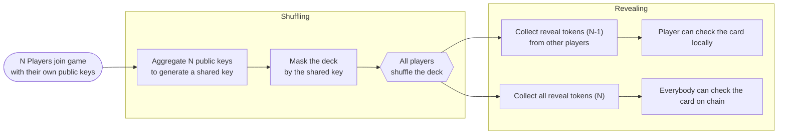
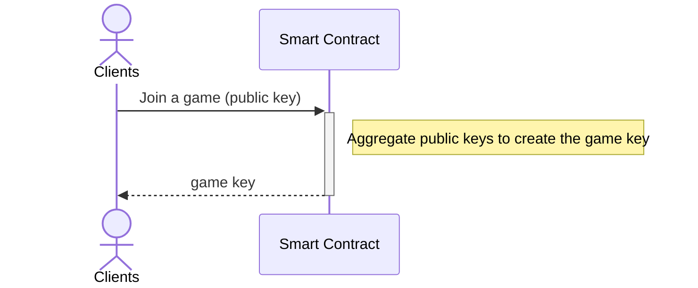
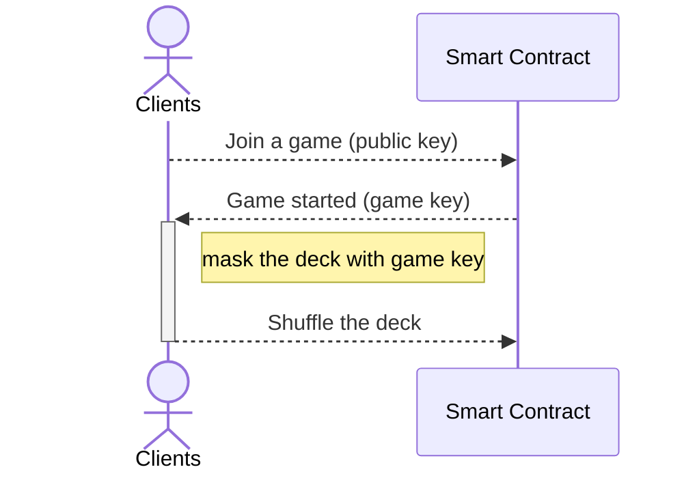
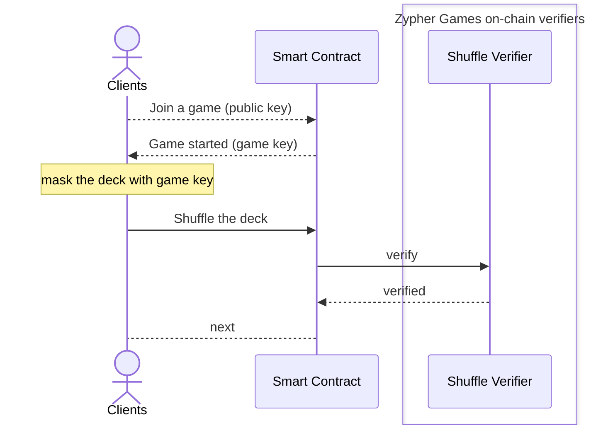
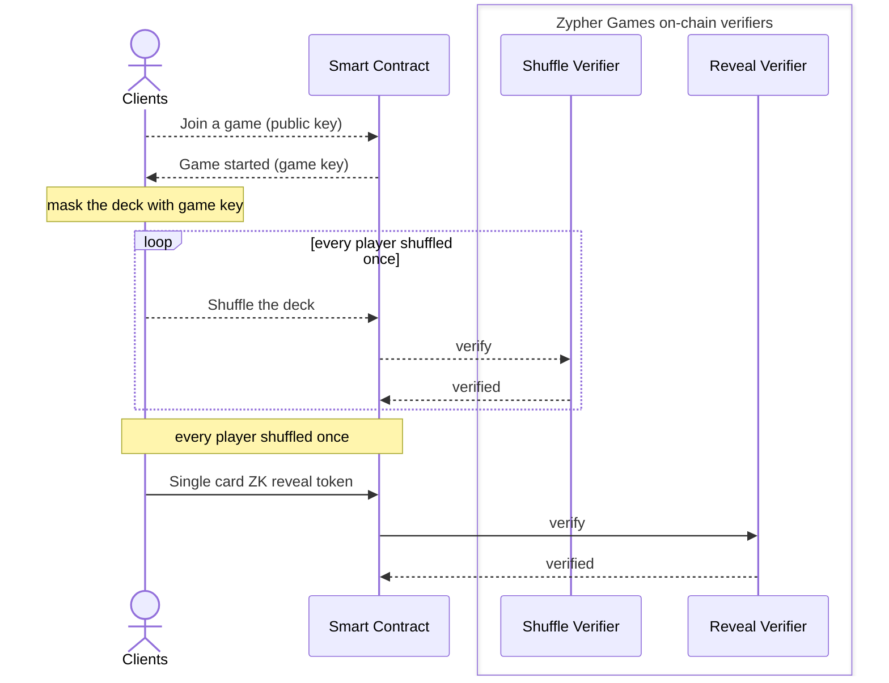

+++
title = "SDK - Shuffle"
description = "Hide card information and ensure card security."
date = 2024-05-01T08:00:00+00:00
updated = 2024-05-01T08:00:00+00:00
draft = false
weight = 5001
sort_by = "weight"
template = "docs/page.html"

[extra]
section = "zk"
lead = 'Hide card information and ensure card security.'
toc = true
top = false
+++

## Environment

- Language: javascript/typescript

## Overview
Almost all multi-player card games require a fair and unpredictable shuffling mechanism.
Simply using random numbers on the chain cannot meet this demand.
Therefore, Zypher provides Shuffle solution, and the usage process is as follows.




Include:

- The beginning of the game
   - All players provide their own public key, which is used to generate the game aggregated key for the game.
   - We use the aggregated key to mask the originally public cards into a deck dedicated to the game.

- Shuffling stage
   - Each player takes turns shuffling the deck and updating the deck based on the previous deck state.
   - When updating the deck, we will use the ZK mechanism to ensure that players have the ability to disrupt the deck based on our rules.

- opening stage
   - For the card whose result is to be displayed, the correct card content can be displayed by gathering the reveal tokens of all players.
   - When submitting reveal tokens, the contract can ensure that each player provides the tokens that comply with the rules through the ZK mechanism.
   - If only a single player wants to see his hand, other players need to calculate the corresponding token of their hand and give it to that player.
   - If the card is to be fully disclosed, all players will hand over the corresponding tokens to the contract, and the card will be confirmed through on-chain calculations.


Below we use a standard game process to demonstrate how to use the Shuffle solution we provide at each stage.

## Installation

We package the WASM and types used on the front-end and the verifier interfaces used on the contract, and upload to NPM packages.
It can be downloaded to the development environment through npm:

```bash
$ npm i @zypher-game/secret-engine
```

For the contract part, please select the verifiers address from the table below:

| Network | Name | Address |
|:------: | :--: | :------ |
| opBNB Testnet | ShuffleVerifier (20) | `0x1De814F9A303253288fa9195C6e7aae7cabB6670` |
| opBNB Testnet | ShuffleVerifier (52) | `0xfbDF4217a3959cE4D3c39b240959c800e3c9E640` |
| opBNB Testnet | RevealVerifier | `0x8d084e5c212834456c07Cef2c1e2a258fF04b5eb` |
| Arbitrum Sepolia Testnet | ShuffleVerifier (20) | `0x.....` |
| Arbitrum Sepolia Testnet | ShuffleVerifier (52) | `0x.....` |
| Arbitrum Sepolia Testnet | RevealVerifier | `0x.....` |


## Game Starts



At the beginning of the game, each player provides his or her public key. After having the public keys of all players, the contract can calculate the game aggregated key specific to the game.

```ts
/**
 * @typedef {`0x${string}`} Hex - A hex string to represent a uint256 type in smart contract,
 *                                starts with 0x, and followed by 64 0-F's.
 * @typedef {`0x${string}`} Bytes - A hex string to represent a bytes type in smart contract,
 *                                  starts with 0x, and followed by various counts of 0-F's
 */

import * as SE from '@zypher-game/secret-engine'
// SE = require('@zypher-game/secret-engine')

/** @type {{ sk: Hex, pk: Hex, pkxy: [Hex, Hex] }} */
const key = SE.generate_key()
// {
//   sk: '0x013c0b55d277082e76dbebccb9bfc880f1ba0da01888151cc276acfa38984067',
//   pk: '0x792c82fa73288f6c90d25225db24349ddb64a01808c836232f14f5c0f770421d',
//   pkxy: [
//     '0x033a5235209daa9f2831ce6153581fb708d5441d606bdc5b1cbe7bd02b6c9bde',
//     '0x1d4270f7c0f5142f2336c80818a064db9d3424db2552d2906c8f2873fa822c79'
//   ]
// }

// send key.pkxy to smart contract to aggregate the game-key
```

Players provide their `key.pkxy` to the contract to generate the encryption key for the game.

After all players have provided public keys, the game aggregated key can be generated through `ZgRevealVerifier::aggregateKeys` on the contract:

```solidity
import { ZgRevealVerifier, Point } from "@zypher-game/secret-engine/Verifiers.sol";

address revealVerifier = 0xRevealVerifierAddress;

contract Game {
    Point[] private publicKeys;
    Point public gameKey;

    function createGameKey() public {
        gameKey = ZgRevealVerifier(revealVerifier).aggregateKeys(publicKeys);
    }
}
```

## Mask the Game Deck

Now, players can obtain the game aggregated key specific to the current game from the contract, and the first player to shuffle the deck needs to mask the entire deck with the game key before shuffling the deck.



We do this part on the client side:

```ts
// Read from Game::gameKey above
// You can transform UInt256 to Hex form by ethers.BigNumber.toHexString() or Viem.toHex(BigInt)
const GAME_KEY = {
  // 19617196613779207970341794679927977798923702524850702039209699977369237063600
  x: '0x2b5ef0976407ba9bcbaff98bd98463845e33431dee905378db8577f6cd3407b0',
  // 4588353255913810257093228132198460617090012643664498862176822601823348662802
  y: '0x0a24ea792f01d36b0842ef58670e8d3fa53c68be4f2b6ec4985d25fa65c92212',
}

/** @type {Hex} */
const gameKey = SE.public_compres([
  GAME_KEY.x,
  GAME_KEY.y,
])
// 0x1222c965fa255d98c46e2b4fbe683ca53f8d0e6758ef42086bd3012f79ea248a

const DECK_SIZE = 52
SE.init_prover_key(DECK_SIZE)
/** @type {Hex[24]} */
const pkc = SE.refresh_joint_key(gameKey, DECK_SIZE)
// ['0x1943430a6dd86225d689b616b0efde793fbd6f3d24ba1a4ee2a8f0ec4f16fed2', ...]

/** @type {{ card: [Hex, Hex, Hex, Hex], proof: Bytes }[]} */
const maskedDeck = SE.init_masked_cards(gameKey, DECK_SIZE)
```

After the first player has masked the deck, he can shuffle the deck directly locally, and we continue to the next section.

## Shuffle the Game Deck



If it is the first player to shuffle the cards, we directly adjust the result of the previous step to the same specifications as the contract.
If it is the second player or later, the deck will be shuffled directly with the deck found on the contract.

```ts
/** @type {[Hex, Hex, Hex, Hex][]} */
let deckBefore = []

// 1st shuffler only:
deckBefore = maskedDeck.map((masked) => masked.card)
// 2nd to last shufflers, the deck is read from the game contract.
deckBefore = (await game.deck()).map(hashes => hashes.map(bn => bn.toHexString()))

/** @type {{ cards: [Hex, Hex, Hex, Hex][], proof: Bytes }} */
const shuffled = SE.shuffle_cards(gameKey, deckBefore)

// Send pkc & shuffled.cards & shuffled.proof to the game contract.
```

When the client completes the shuffling, the previous and new deck, proof and pkc are submitting to the contract to verify and update the deck.

```solidity
import { ZgShuffleVerifier } from "@zypher-game/secret-engine/Verifiers.sol";

address shuffleVerifier = 0xShuffleVerifierAddress;

contract Game {
    uint256[4][] public deck;
    uint256[24] public pkc;

    // Only the 1st shuffler; require the masked deck (before) & pkc
    function initShuffle(
      uint256[24] calldata pkc_,
      uint256[4][52] calldata before_,
      uint256[4][52] calldata after_,
      bytes calldata proof_
    ) public {
        require(deck.length == 0); // Only for the 1st time shuffler
        pkc = pkc_;
        uint256[] memory input = new uint256[](52 * 4 * 2);

        for (uint8 i = 0; i < 52; i++) {
            input[i * 4 + 0] = before_[i][0];
            input[i * 4 + 1] = before_[i][1];
            input[i * 4 + 2] = before_[i][2];
            input[i * 4 + 3] = before_[i][3];

            input[i * 4 + 0 + 208] = after_[i][0];
            input[i * 4 + 1 + 208] = after_[i][1];
            input[i * 4 + 2 + 208] = after_[i][2];
            input[i * 4 + 3 + 208] = after_[i][3];
        }

        require(
            ZgShuffleVerifier(shuffleVerifier).verifyShuffle(proof_, input, pkc_)
        );

        pkc = pkc_;
        deck = after_;
    }

    // 2nd .. Nth shuffle
    function shuffle(
        uint256[4][52] calldata after_,
        bytes calldata proof_
    ) public {
        require(deck.length == 52);

        uint256[] memory input = new uint256[](52 * 4 * 2);

        for (uint8 i = 0; i < 52; i++) {
            input[i * 4 + 0] = deck[i][0];
            input[i * 4 + 1] = deck[i][1];
            input[i * 4 + 2] = deck[i][2];
            input[i * 4 + 3] = deck[i][3];

            input[i * 4 + 0 + 208] = after_[i][0];
            input[i * 4 + 1 + 208] = after_[i][1];
            input[i * 4 + 2 + 208] = after_[i][2];
            input[i * 4 + 3 + 208] = after_[i][3];
        }

        require(
            ZgShuffleVerifier(shuffleVerifier).verifyShuffle(proof_, input, pkc)
        );

        deck = after_;
    }
}
```

## Submit ZK Reveal Tokens

After all players have shuffled the deck, if player want the "value" of any card, they must collect the ZK information (reveal token) provided by all other players to unlock it.

When players submit card reveal tokens, they can ensure their correctness with the Reveal Verifier we provide:



To generate the ZK reveal token of any card, it can be calculated on the client side using the player's secret key:

```ts
// Read from the Game contract deck, format the card into Hex string form:
const card = [
  '0x2e38a93db7f4a1da169218f5eccd3ff5211b1708913f1b202a8c4b8ece29e8d7',
  '0x0e5b527f880591f57d6acc82b72f526ebff10ff88f7a12d8abb6ed842e25b4cc',
  '0x1e7737dbacb218ad9f6ff22895ba8fb6b3394f41d581a8fb60d76e2cbeecee2e',
  '0x2fc94d679ff1d9723d7a18f23b2c4d7ccfdb91014b61398ed2e17d50c5838292',
]

SE.init_reveal_key() // Cache data when client is free

/** @type { card: [Hex, Hex], snark_proof: Hex[8] } */
const res = SE.reveal_card_with_snark(sk, card)

// Send reveal token (res.card) & proof (res.snark_proof) to contract to provide to other players
```

When the contract receives the ZK reveal token and proof, it can be verified online instantly:

```solidity
import { ZgRevealVerifier, Point } from "@zypher-game/secret-engine/Verifiers.sol";

address revealVerifier = 0xRevealVerifierAddress;

contract Game {
    mapping(address => Point) public publicKeys;

    uint256[4][] public deck;
    mapping(uint256 => Point[]) public rTokens;

    function revealCard(
        uint8 index,
        Point calldata revealToken,
        uint256[8] calldata proof
    ) public {
        require(
            ZgRevealVerifier(revealVerifier).verifyRevealWithSnark(
                [
                    deck[index][2],
                    deck[index][3],
                    revealToken.x,
                    revealToken.y,
                    publicKeys[msg.sender].x,
                    publicKeys[msg.sender].y
                ],
                proof
            )
        );

        rTokens[index].push(revealToken);
    }
}
```

After collecting a sufficient number of reveal tokens, player will get the card's "value".

## Reveal Card

There are two calculation methods, one is calculated on the client side, and the other is calculated on the contract:

- Local:
   - Through reveal tokens provided by other players, player can locally reveal cards whose results only player can see:

    ```ts
    /** @type {number} */
    const cardId = SE.unmask_card(key.sk, deck[index], rTokens)
    // 8 (0 - 51)
    ```

- Public in the contract:
   - All players provide reveal tokens, and the contract reveals the card through Reveal Verifier:

    ```solidity
    import { ZgRevealVerifier, MaskedCard } from "@zypher-game/secret-engine/Verifiers.sol";

    uint8 cardId = ZgRevealVerifier(revealVerifier).unmaskCard(
        MaskedCard(deck[index][0], deck[index][1], deck[index][2], deck[index][3]),
        rTokens[index]
    );
    // 8
    ```

Through the above two methods, the common card shuffling and opening process can be achieved.
