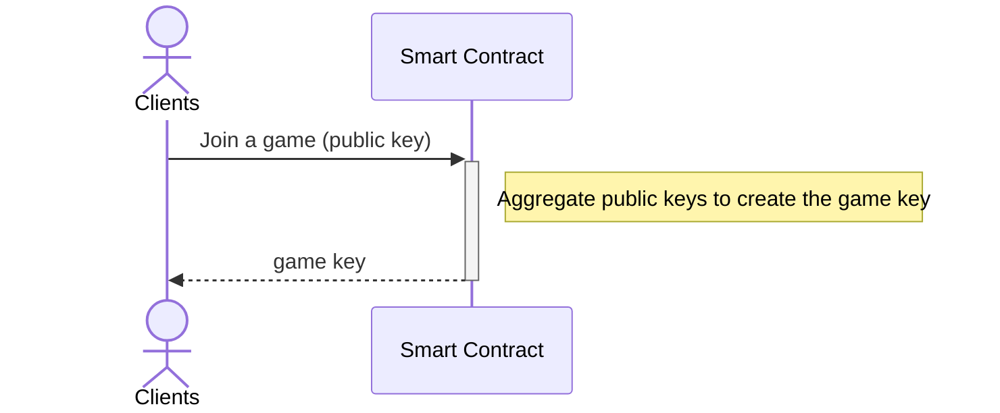
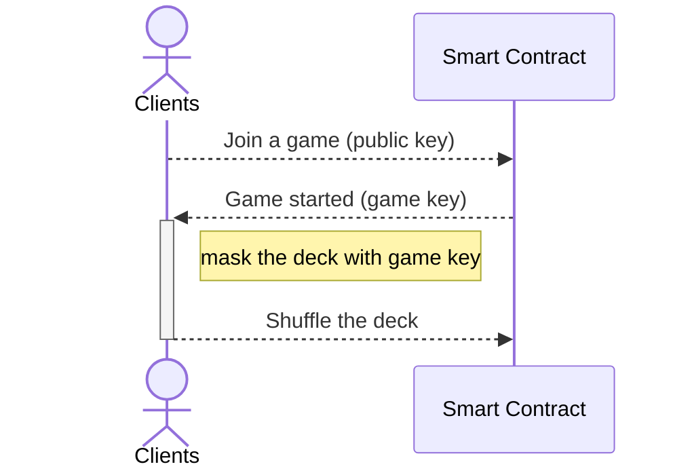
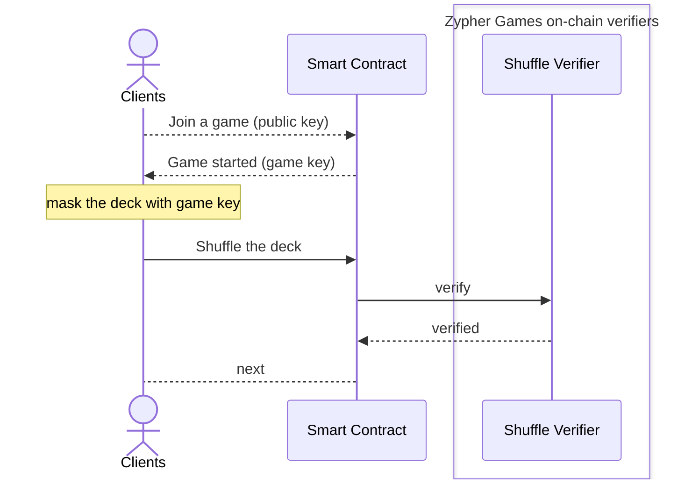
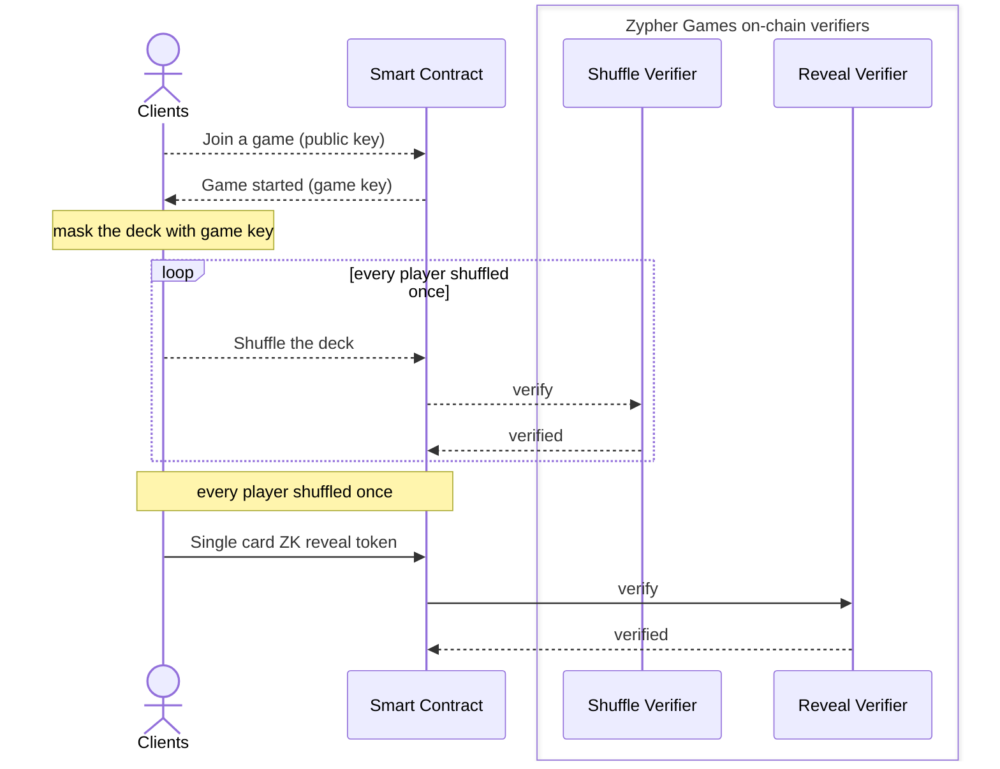

+++
title = "SDK - Shuffle"
description = "Hide card information and ensure card security."
date = 2024-05-01T08:00:00+00:00
updated = 2024-05-01T08:00:00+00:00
draft = false
weight = 5001
sort_by = "weight"
template = "docs/page.html"

[extra]
section = "zk"
lead = 'Hide card information and ensure card security.'
toc = true
top = false
+++

## Environment

- Language: javascript/typescript

## Overview
幾乎所有多人的卡牌類型，都需要一個公平且不可預測的洗牌機制，單純使用鏈上隨機數無法滿足此需求，
因此 Zypher Games 提供 Shuffle solution，使用流程如下:


主要分為：

- 賽局開始階段
  - 所有玩家提供自己的 public key，用來生成該賽局的 game key。
  - 我們透過 game key，將原本公開的牌卡，mask 成該賽局專用的牌組。

- 洗牌階段
  - 每位玩家輪流基於前一個牌組狀態，打亂牌組並更新牌堆。
  - 更新牌堆時，我們會通過 ZK 機制，確保玩家有基於我們的規則來打亂牌組。

- 開牌階段
  - 針對要顯示出結果的牌，湊齊所有玩家的 reveal token 即可顯示出正確的牌卡內容。
  - 提交 token 時，合約可以通過 ZK 機制確保每位玩家有提供符合規則的 token。
  - 如果只有單一玩家要看到自己手牌，則其他玩家需要算出其手牌的對應 token 並交給該玩家。
  - 如果是要完全公開此牌卡，則所有玩家將對應的 token 交給合約，透過鏈上計算，確認牌卡。


以下我們用一個標準遊戲的進行過程來演示個階段如何使用我們所提供的 Shuffle solution.

## Installation

我們將前端使用的 WASM 及 types，與合約端使用到的 verifier interfaces 放在 NPM packages 中，
可以透過 npm 下載到開發環境中：

```bash
$ npm i @zypher-game/secret-engine
```

合約部分，請從下表中挑選合適的 verifiers 地址：

| Network | Name | Address |
|:------: | :--: | :------ |
| opBNB Testnet | ShuffleVerifier (20) | `0x1De814F9A303253288fa9195C6e7aae7cabB6670` |
| opBNB Testnet | ShuffleVerifier (52) | `0xfbDF4217a3959cE4D3c39b240959c800e3c9E640` |
| opBNB Testnet | RevealVerifier | `0x8d084e5c212834456c07Cef2c1e2a258fF04b5eb` |
| Arbitrum Sepolia Testnet | ShuffleVerifier (20) | `0x.....` |
| Arbitrum Sepolia Testnet | ShuffleVerifier (52) | `0x.....` |
| Arbitrum Sepolia Testnet | RevealVerifier | `0x.....` |


## Game Starts



遊戲開始階段，每位玩家提供自己的 public key。有了所有玩家的 public keys 後，合約上可以計算出該賽局專用的 game key。

```ts
/**
 * @typedef {`0x${string}`} Hex - A hex string to represent a uint256 type in smart contract,
 *                                starts with 0x, and followed by 64 0-F's.
 * @typedef {`0x${string}`} Bytes - A hex string to represent a bytes type in smart contract,
 *                                  starts with 0x, and followed by various counts of 0-F's
 */

import * as SE from '@zypher-game/secret-engine'
// SE = require('@zypher-game/secret-engine')

/** @type {{ sk: Hex, pk: Hex, pkxy: [Hex, Hex] }} */
const key = SE.generate_key()
// {
//   sk: '0x013c0b55d277082e76dbebccb9bfc880f1ba0da01888151cc276acfa38984067',
//   pk: '0x792c82fa73288f6c90d25225db24349ddb64a01808c836232f14f5c0f770421d',
//   pkxy: [
//     '0x033a5235209daa9f2831ce6153581fb708d5441d606bdc5b1cbe7bd02b6c9bde',
//     '0x1d4270f7c0f5142f2336c80818a064db9d3424db2552d2906c8f2873fa822c79'
//   ]
// }

// send key.pkxy to smart contract to aggregate the game-key
```

玩家將自己的 `key.pkxy` 提供給合約，用來產出該賽局的加密密鑰。

在所有玩家都提供完 public keys 後，合約上可以透過 `ZgRevealVerifier::aggregateKeys` 生成 game key：

```solidity
import { ZgRevealVerifier, Point } from "@zypher-game/secret-engine/Verifiers.sol";

address revealVerifier = 0xRevealVerifierAddress;

contract Game {
    Point[] private publicKeys;
    Point public gameKey;

    function createGameKey() public {
        gameKey = ZgRevealVerifier(revealVerifier).aggregateKeys(publicKeys);
    }
}
```

## Mask the Game Deck

現在，玩家可以從合約中取得當前賽局專用的 game key，而第一位洗牌的玩家，在洗牌之前，需要先透過 game key 將整個牌組 mask。



這部分我們在 client 端進行：

```ts
// Read from Game::gameKey above
// You can transform UInt256 to Hex form by ethers.BigNumber.toHexString() or Viem.toHex(BigInt)
const GAME_KEY = {
  // 19617196613779207970341794679927977798923702524850702039209699977369237063600
  x: '0x2b5ef0976407ba9bcbaff98bd98463845e33431dee905378db8577f6cd3407b0',
  // 4588353255913810257093228132198460617090012643664498862176822601823348662802
  y: '0x0a24ea792f01d36b0842ef58670e8d3fa53c68be4f2b6ec4985d25fa65c92212',
}

/** @type {Hex} */
const gameKey = SE.public_compres([
  GAME_KEY.x,
  GAME_KEY.y,
])
// 0x1222c965fa255d98c46e2b4fbe683ca53f8d0e6758ef42086bd3012f79ea248a

const DECK_SIZE = 52
SE.init_prover_key(DECK_SIZE)
/** @type {Hex[24]} */
const pkc = SE.refresh_joint_key(gameKey, DECK_SIZE)
// ['0x1943430a6dd86225d689b616b0efde793fbd6f3d24ba1a4ee2a8f0ec4f16fed2', ...]

/** @type {{ card: [Hex, Hex, Hex, Hex], proof: Bytes }[]} */
const maskedDeck = SE.init_masked_cards(gameKey, DECK_SIZE)
```

第一位玩家在將 deck masked 後，直接在本地進行洗牌即可，我們繼續進行到下一節。

## Shuffle the Game Deck



如果是第一位洗牌的玩家，我們直接將前一步驟的結果，調整為跟合約相同的規格。
若是第二位以後的玩家，則直接以合約上查詢到的牌組來接著洗。

```ts
/** @type {[Hex, Hex, Hex, Hex][]} */
let deckBefore = []

// 1st shuffler only:
deckBefore = maskedDeck.map((masked) => masked.card)
// 2nd to last shufflers, the deck is read from the game contract.
deckBefore = (await game.deck()).map(hashes => hashes.map(bn => bn.toHexString()))

/** @type {{ cards: [Hex, Hex, Hex, Hex][], proof: Bytes }} */
const shuffled = SE.shuffle_cards(gameKey, deckBefore)

// Send pkc & shuffled.cards & shuffled.proof to the game contract.
```

當 Client 端完成洗牌後，將洗牌前後的 deck 與 proof 以及 pkc 交給合約來驗證並更新 deck。

```solidity
import { ZgShuffleVerifier } from "@zypher-game/secret-engine/Verifiers.sol";

address shuffleVerifier = 0xShuffleVerifierAddress;

contract Game {
    uint256[4][] public deck;
    uint256[24] public pkc;

    // Only the 1st shuffler; require the masked deck (before) & pkc
    function initShuffle(
      uint256[24] calldata pkc_,
      uint256[4][52] calldata before_,
      uint256[4][52] calldata after_,
      bytes calldata proof_
    ) public {
        require(deck.length == 0); // Only for the 1st time shuffler
        pkc = pkc_;
        uint256[] memory input = new uint256[](52 * 4 * 2);

        for (uint8 i = 0; i < 52; i++) {
            input[i * 4 + 0] = before_[i][0];
            input[i * 4 + 1] = before_[i][1];
            input[i * 4 + 2] = before_[i][2];
            input[i * 4 + 3] = before_[i][3];

            input[i * 4 + 0 + 208] = after_[i][0];
            input[i * 4 + 1 + 208] = after_[i][1];
            input[i * 4 + 2 + 208] = after_[i][2];
            input[i * 4 + 3 + 208] = after_[i][3];
        }

        require(
            ZgShuffleVerifier(shuffleVerifier).verifyShuffle(proof_, input, pkc_)
        );

        pkc = pkc_;
        deck = after_;
    }

    // 2nd .. Nth shuffle
    function shuffle(
        uint256[4][52] calldata after_,
        bytes calldata proof_
    ) public {
        require(deck.length == 52);

        uint256[] memory input = new uint256[](52 * 4 * 2);

        for (uint8 i = 0; i < 52; i++) {
            input[i * 4 + 0] = deck[i][0];
            input[i * 4 + 1] = deck[i][1];
            input[i * 4 + 2] = deck[i][2];
            input[i * 4 + 3] = deck[i][3];

            input[i * 4 + 0 + 208] = after_[i][0];
            input[i * 4 + 1 + 208] = after_[i][1];
            input[i * 4 + 2 + 208] = after_[i][2];
            input[i * 4 + 3 + 208] = after_[i][3];
        }

        require(
            ZgShuffleVerifier(shuffleVerifier).verifyShuffle(proof_, input, pkc)
        );

        deck = after_;
    }
}
```

## Submit ZK Reveal Tokens

在所有玩家都 shuffled deck 後，現在如果想要任一張卡牌的原始內容，必須搜集其他所有玩家提供的 ZK 資訊 (reveal token) 才能解開。

當玩家提交卡牌 reveal tokens 時，可以我們提供的 Reveal Verifier 確保其正確性：



要產出任一張卡牌的 ZK reveal token，可在 client 端利用玩家的 secret key 計算得出：

```ts
// Read from the Game contract deck, format the card into Hex string form:
const card = [
  '0x2e38a93db7f4a1da169218f5eccd3ff5211b1708913f1b202a8c4b8ece29e8d7',
  '0x0e5b527f880591f57d6acc82b72f526ebff10ff88f7a12d8abb6ed842e25b4cc',
  '0x1e7737dbacb218ad9f6ff22895ba8fb6b3394f41d581a8fb60d76e2cbeecee2e',
  '0x2fc94d679ff1d9723d7a18f23b2c4d7ccfdb91014b61398ed2e17d50c5838292',
]

SE.init_reveal_key() // Cache data when client is free

/** @type { card: [Hex, Hex], snark_proof: Hex[8] } */
const res = SE.reveal_card_with_snark(sk, card)

// Send reveal token (res.card) & proof (res.snark_proof) to contract to provide to other players
```

當合約收到 ZK reveal token 與 proof 後，可以即時線上驗證：

```solidity
import { ZgRevealVerifier, Point } from "@zypher-game/secret-engine/Verifiers.sol";

address revealVerifier = 0xRevealVerifierAddress;

contract Game {
    mapping(address => Point) public publicKeys;

    uint256[4][] public deck;
    mapping(uint256 => Point[]) public rTokens;

    function revealCard(
        uint8 index,
        Point calldata revealToken,
        uint256[8] calldata proof
    ) public {
        require(
            ZgRevealVerifier(revealVerifier).verifyRevealWithSnark(
                [
                    deck[index][2],
                    deck[index][3],
                    revealToken.x,
                    revealToken.y,
                    publicKeys[msg.sender].x,
                    publicKeys[msg.sender].y
                ],
                proof
            )
        );

        rTokens[index].push(revealToken);
    }
}
```

當收集足夠量的 reveal tokens 後，我們接著算出其代表的卡牌。

## Reveal Card

計算方式有兩種，一種是在 client 端計算，另一種是在合約上計算：

- 本地揭露:
  - 透過其他玩家提供的 reveal tokens，在本地揭露僅有自己可以看到結果的卡牌：

    ```ts
    /** @type {number} */
    const cardId = SE.unmask_card(key.sk, deck[index], rTokens)
    // 8 (0 - 51)
    ```

- 合約上公開:
  - 所有玩家都提供 reveal tokens，合約透過 Reveal Verifier 揭露該卡牌：

    ```solidity
    import { ZgRevealVerifier, MaskedCard } from "@zypher-game/secret-engine/Verifiers.sol";

    uint8 cardId = ZgRevealVerifier(revealVerifier).unmaskCard(
        MaskedCard(deck[index][0], deck[index][1], deck[index][2], deck[index][3]),
        rTokens[index]
    );
    // 8
    ```

透過以上兩種方式，便可以達成常見的卡牌洗牌與開牌過程。
